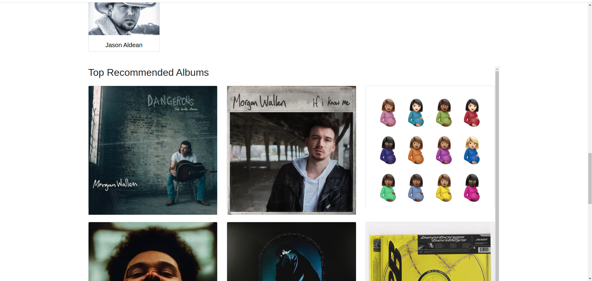

# Musix-App

## Basic Intro

- This is a music sample streaming app. 
- Music samples can be searched based on author name, song name, song title.
- Search results will display relevant Audio samples, Artist information from Napster.com API and relevant Video from youtube API.  

## Features
- Displays the top Artists and Songs in the Home page.
- Add songs to favourites list for loggedIn Users.
- Allows you to recommend songs globally to all users.
- Search songs based on artist, song name, song titile.
- Very Interactive UI.
- User Registration and Basic Authentication.
## Improvements needed
- cache the search results as the youtube and Napster API has daily limit on number of API calls.
- UI improvements

# SCREENSHOTS
## Albums

 

## Artists

## Register and Login 

## Home 

## Search Results 

